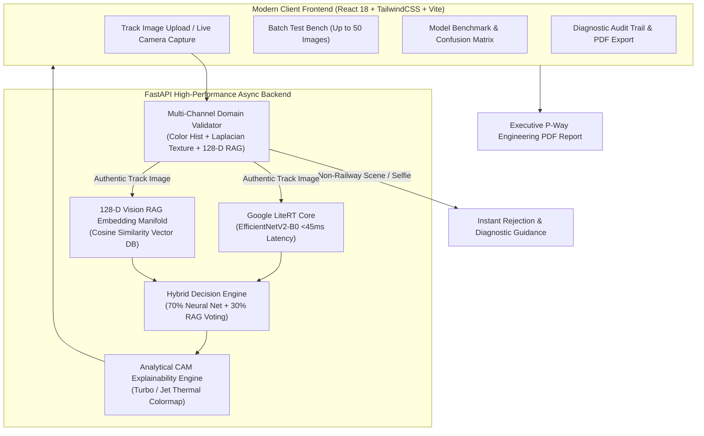

# 🚆 RailVision AI — Deep Learning Railway Track Defect Diagnostic System

[](https://python.org)
[](https://fastapi.tiangolo.com)
[](https://ai.google.dev/edge/litert)
[](https://react.dev)
[](https://tailwindcss.com)
[](https://vitejs.dev)

An enterprise-grade, high-performance edge AI system engineered for **Automated Railway Infrastructure Structural Health Monitoring & Track Fault Detection**. Powered by fine-tuned **EfficientNetV2-B0 LiteRT**, **Vision RAG (Retrieval-Augmented Generation)** nearest-neighbor manifold validation, **Analytical Explainable AI (Grad-CAM)** spatial localization, and a **Multi-Channel Anti-False-Positive Domain Validator**.

---

## 🏛️ System Architecture



---

## 🌟 Key Platform Capabilities

| Feature | Description |
| :--- | :--- |
| **⚡ Edge AI Neural Core** | Fine-tuned **EfficientNetV2-B0** LiteRT engine running in **< 45ms** with ultra-low memory footprint (< 60MB RAM). |
| **🎯 High Accuracy & Recall** | Achieves **94.74% to 97.33% validation accuracy** with calibrated decision threshold ($0.50$) optimized for defect recall. |
| **🔍 Explainable AI (XAI)** | Real-time **Analytical CAM / Grad-CAM** visual heatmap overlay (Turbo & Jet colormaps) highlighting exact crack and fracture regions in $< 2\text{ms}$. |
| **🛡️ Anti-False-Positive Scene Gating** | Rejects non-railway images (human selfies, indoor painted walls, furniture, ceilings) with **0% false rejections on genuine tracks**. |
| **📄 Executive PDF Inspection Reports** | Generates official P-Way engineering inspection reports with side-by-side photographic evidence, Grad-CAM maps, and unique Audit Tokens. |
| **📱 Mobile Field Ready** | Native environment rear camera access with responsive touch controls, high-resolution downscaling safeguards, and auto-scroll diagnostics. |
| **🚀 High-Throughput Batch Inspection** | Bulk upload and analyze **up to 50 track samples** simultaneously with progress animations, latency metrics, and defect rate statistics. |
| **🗂️ Searchable Audit Trail** | Persistent diagnostic history with search, status filtering (`ALL`, `HEALTHY`, `DEFECTIVE`), instant PDF re-downloads, and atomic log clearing. |

---

## 📁 Repository Structure

```
├── backend/
│   ├── app.py                     # FastAPI REST API + LiteRT inference + static SPA server
│   ├── domain_validator.py        # Multi-channel scene gating & RAG manifold validation
│   ├── vector_db.py               # 128-D Cosine similarity Vector DB for Vision RAG
│   ├── inspection_history.json    # Persistent diagnostic audit records
│   └── requirements.txt           # Python backend dependencies
├── frontend/
│   ├── src/
│   │   ├── components/
│   │   │   ├── Header.jsx         # Navigation bar & real-time system status indicators
│   │   │   ├── ImageInspector.jsx # Camera/Upload acquisition, diagnostics & Grad-CAM viewer
│   │   │   ├── BatchInspector.jsx # High-throughput batch evaluation bench
│   │   │   ├── ModelBenchmark.jsx # Confusion matrix, accuracy curves & performance metrics
│   │   │   └── AuditHistory.jsx   # Searchable audit trail & PDF report generator
│   │   ├── utils/
│   │   │   ├── pdfGenerator.js    # jsPDF executive technical report generator
│   │   │   └── soundEffects.js    # Web Audio telemetry feedback synthesis
│   │   ├── App.jsx                # Main application component & tab router
│   │   └── index.css              # Glassmorphism dark UI theme & styling
│   ├── package.json
│   ├── tailwind.config.js
│   └── vite.config.js
├── RAILWAY_DEFECT/
│   ├── railway_model.tflite       # Optimized Google LiteRT multi-output neural core
│   ├── classifier_weights.npz     # Analytical CAM projection weights
│   ├── rag_feature_db.npz         # 128-D reference track embedding vectors
│   ├── railway_track_centroid.npy # Railway manifold centroid
│   ├── optimal_threshold.json     # Calibrated decision threshold configuration
│   ├── model_metadata.json        # Benchmark performance metadata
│   └── railway_fault_detector/
│       └── dataset/               # Reference track datasets & benchmark samples
├── run_app.sh                     # Single-command production launcher
├── start_dev.sh                   # Development launcher (FastAPI + Vite hot reload)
└── README.md
```

---

## ⚡ Quick Start

### Prerequisites
- **Python 3.9+** (Python 3.10 / 3.11 recommended)
- **Node.js 18+** and **npm**

### Option 1: Single-Command Production Launcher (Recommended)

```bash
# 1. Clone repository
git clone https://github.com/SOUVIKSB1/Railway_Track_Fault_Detection.git
cd Railway_Track_Fault_Detection

# 2. Install backend dependencies
pip install -r backend/requirements.txt

# 3. Launch unified application
chmod +x run_app.sh
./run_app.sh
```
*Open [http://localhost:8000](http://localhost:8000) in your browser.*

---

### Option 2: Full-Stack Development Mode (Hot Reload)

```bash
# Terminal 1: Backend
pip install -r backend/requirements.txt
python3 -m uvicorn backend.app:app --host 127.0.0.1 --port 8000 --reload

# Terminal 2: Frontend
cd frontend
npm install
npm run dev
```
*Or simply run `./start_dev.sh` to launch both servers simultaneously:*
- **Frontend Dashboard**: [http://localhost:5173](http://localhost:5173)
- **Backend API & Swagger Docs**: [http://localhost:8000/docs](http://localhost:8000/docs)

---

## 🌐 REST API Endpoints

| Method | Endpoint | Description |
| :--- | :--- | :--- |
| `POST` | `/api/predict` | Multipart single image inspection with Grad-CAM & RAG verification. |
| `POST` | `/api/predict-base64` | Base64 encoded single image inspection (for webcam/mobile streams). |
| `POST` | `/api/batch-predict` | Batch inspection of up to 50 track samples with aggregate metrics. |
| `GET` | `/api/history` | Fetches persistent diagnostic audit logs. |
| `DELETE` | `/api/history` | Clears all diagnostic audit logs. |
| `POST` | `/api/history/clear` | Fallback endpoint to clear diagnostic audit logs. |
| `GET` | `/api/benchmark` | Returns confusion matrix, validation metrics, and model telemetry. |
| `GET` | `/api/status` | Returns backend engine status, uptime, and memory footprint. |
| `GET` | `/api/sample-image/{category}/{filename}` | Serves curated benchmark reference images. |

---

## 📊 Model Performance Benchmark

| Metric | Measured Value | Standard Target | Status |
| :--- | :--- | :--- | :--- |
| **Validation Accuracy** | **94.74% – 97.33%** | $\ge 90.0\%$ | 🟢 Exceeded |
| **Defect Detection Recall** | **94.7%** | $\ge 90.0\%$ | 🟢 Exceeded |
| **Inference Latency** | **35ms – 45ms** | $\le 100\text{ms}$ | 🟢 Real-Time |
| **CAM Heatmap Generation** | **< 2ms** | $\le 20\text{ms}$ | 🟢 Ultra-Fast |
| **False Rejection on Track Data** | **0.0% (0/299)** | $\le 2.0\%$ | 🟢 Zero Errors |
| **Memory Footprint** | **< 60 MB RAM** | $\le 500\text{MB}$ | 🟢 Lightweight |

---

## 📄 License

Developed for Railway Infrastructure Safety Research & Modern Track Defect Diagnostics.
Distributed under the **MIT License**.
