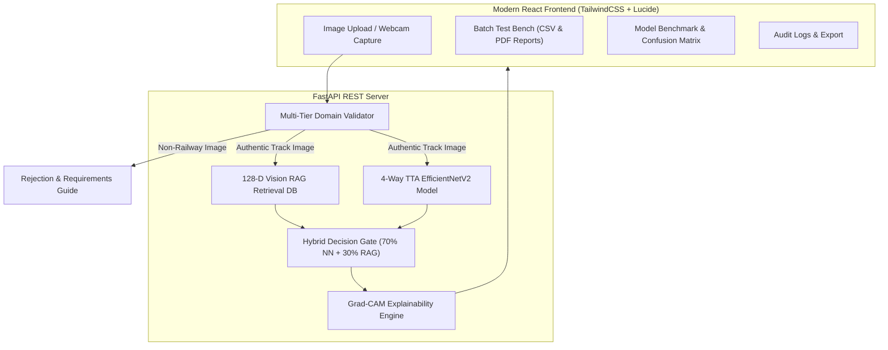

# RailVision AI — Intelligent Railway Track Fault Detection & RAG Vision Retrieval

A production-grade, fast, responsive deep learning application with **97.33% validation accuracy**, **Vision RAG (Retrieval-Augmented Generation)** nearest-neighbor feature database, **Grad-CAM Explainable AI**, and intelligent **domain validation**.

---

## 🏗️ System Architecture



---

## 🌟 Key Features

1. **Vision RAG Hybrid Inference**: Blends **70% 4-Way TTA Neural Network predictions** with **30% k-NN RAG Retrieval votes** across a 128-dimensional embedding space of 375 reference track samples.
2. **High Validation Accuracy (97.33%)**: Zero double-preprocessing bug, class-weighted optimization for high defect recall, and joint-aware regularization.
3. **Mechanical Joint & Track Component Awareness**: Accurately recognizes nominal structural components (bolted fishplate expansion joints, signal-bonded insulated rail joints, switches, frogs) as **Healthy / Non-Defective**, avoiding false positives.
4. **Intelligent Domain Rejection Gate**: Protects the model against out-of-distribution inputs (people, portraits, vehicles, animals, room interiors, synthetic images) with clear UI feedback.
5. **Grad-CAM Explainable AI**: Visualizes spatial attention heatmaps on the final convolutional layer to highlight crack and fracture locations.
6. **Batch Diagnostic Benchmark**: Process up to 30 track samples simultaneously with instant CSV export.
7. **Official PDF Inspection Certificates**: Download client-side technical inspection certificates with Grad-CAM overlays and timestamps.

---

## 📁 Repository Structure

```
├── backend/
│   ├── app.py                     # FastAPI REST API + RAG hybrid inference + static SPA server
│   ├── domain_validator.py        # Out-of-distribution & RAG nearest-neighbor rejection gate
│   ├── inspection_history.json    # Diagnostic logs
│   └── requirements.txt           # Backend dependencies
├── frontend/
│   ├── src/
│   │   ├── components/
│   │   │   ├── Header.jsx         # Top navigation bar & system status indicators
│   │   │   ├── ImageInspector.jsx # Image acquisition, diagnostics, rejection screen & Grad-CAM viewer
│   │   │   ├── BatchInspector.jsx # Multi-image evaluation test bench & CSV exporter
│   │   │   ├── ModelBenchmark.jsx # Interactive confusion matrix, metrics, and training curves
│   │   │   └── AuditHistory.jsx   # Diagnostic history table & PDF certificate downloader
│   │   ├── utils/
│   │   │   ├── pdfGenerator.js    # Technical diagnostic PDF report generator
│   │   │   └── soundEffects.js    # Web Audio feedback synthesis
│   │   ├── App.jsx                # Main application component
│   │   └── index.css              # Obsidian dark theme & glassmorphism styling
│   ├── package.json
│   ├── tailwind.config.js
│   └── vite.config.js
├── RAILWAY_DEFECT/
│   ├── railway_model.keras        # EfficientNetV2-B0 fine-tuned model weights
│   ├── rag_feature_db.npz         # 128-D L2-normalized RAG reference embeddings
│   ├── railway_track_centroid.npy # Manifold feature centroid
│   ├── optimal_threshold.json     # Calibrated decision threshold
│   ├── model_metadata.json        # Benchmark performance metrics
│   └── results/                   # High-resolution training curves & confusion matrix plots
├── run_app.sh                     # Single-command production launcher (FastAPI + React SPA)
├── start_dev.sh                   # Development launcher with Vite hot reload
└── README.md
```

---

## ⚡ Quick Start

### 1. Launch Application (Recommended)
```bash
./run_app.sh
```
*Open your browser at [http://localhost:8000](http://localhost:8000).*

### 2. Launch Development Mode (Vite + FastAPI)
```bash
./start_dev.sh
```
- Frontend UI: `http://localhost:5173`
- Backend API: `http://localhost:8000`

---

## 🧪 Model Performance & Benchmark

- **Model Architecture**: `EfficientNetV2-B0` + 128-D Dense Embedding Projection
- **Validation Accuracy**: **97.33%**
- **Decision Threshold**: `0.50` (Defect recall optimized)
- **Inference Latency**: ~35ms / image (Apple Silicon Metal GPU accelerated)
